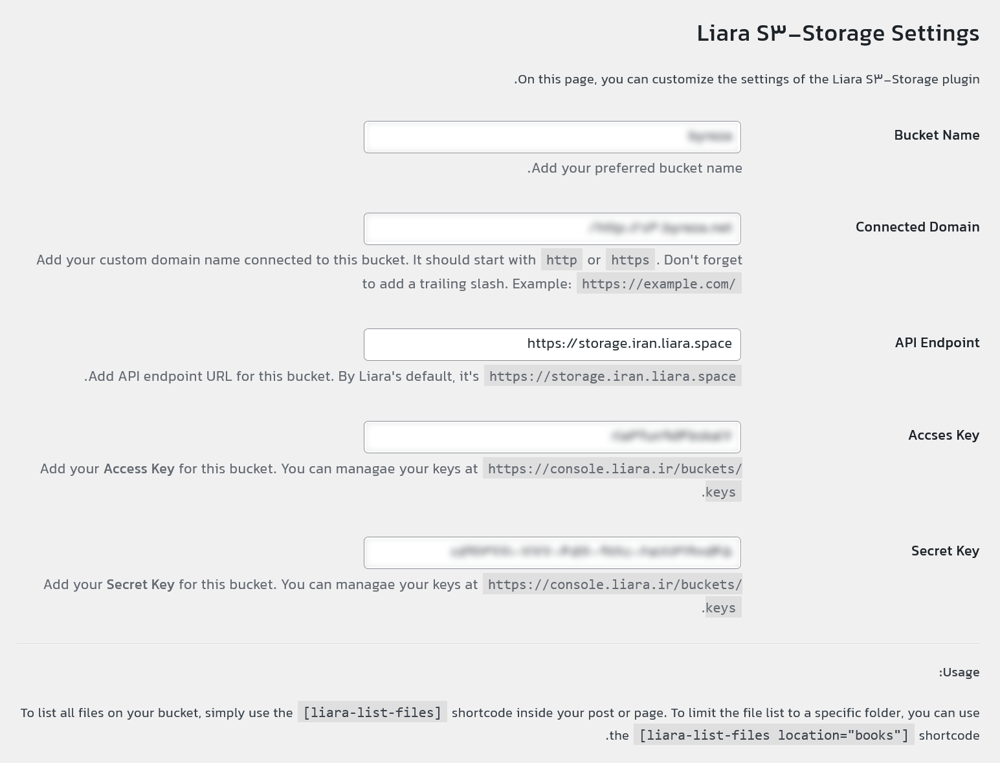

# Liara S3-Storage for WordPress
A simple UI to access [Liara](https://liara.ir/products/object-storage/) S3 storage files within your WordPress site.

# How to Use

To list all files in your Liara bucket, simply use the <code>[liara-list-files]</code> shortcode inside your post or page. To limit the file list to a specific folder, use the <code>[liara-list-files location="books"]</code> shortcode.

## Multi-Lingual

The plugin supports internationalization (i18n) through translation files (`po/mo`). The provided **.pot** file helps you translate the plugin into your preferred language. If the language files do not load your locale, copy the `po/mo` files from **/languages** directory to the **/wp-content/languages/plugins** directory in your WordPress installation.

## Prettify the Output

This plugin generates an unordered list element to display all your files in a defined bucket/path. This `ul` element has a `liara-files` class, allowing you to style it with CSS.

## Settings Page

